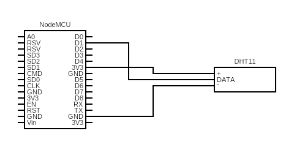

# esp8266-dht11-server
This code serves a RESTful API from a esp8266 board with DHT11 sensor

## Wiring
This wiring must be compled as shown or modifications are needed to the code



## Configuration
Setup the SSID and Password of your network in the file

## Setup
Once the app is running and the proper baud rate is selected (115200) then the app will show the IP address assigned to the board. This address is used to call the app over HTTP.

The cURL command can be used to obtain the JSON response:
```bash
curl -i <board ip>
```

## Dependances
1. Additional boards manager URL: http://arduino.esp8266.com/stable/package_esp8266com_index.json
2. [Arduino JSON](https://github.com/arduino-libraries/Arduino_JSON)
3. [DHT Library](https://github.com/adafruit/DHT-sensor-library)